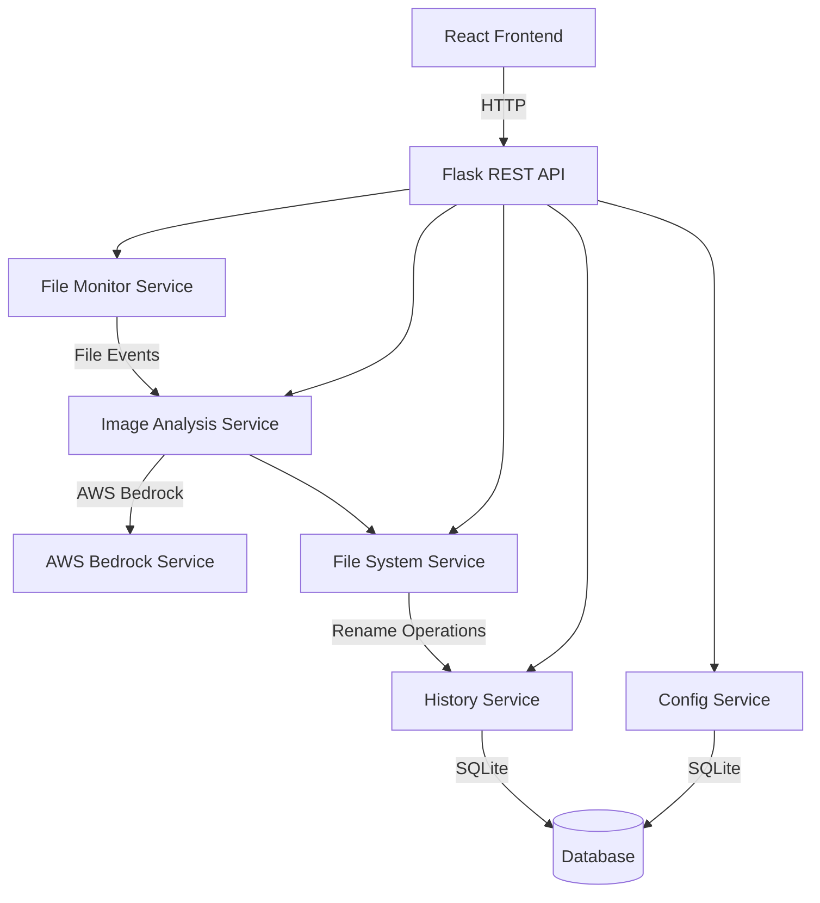
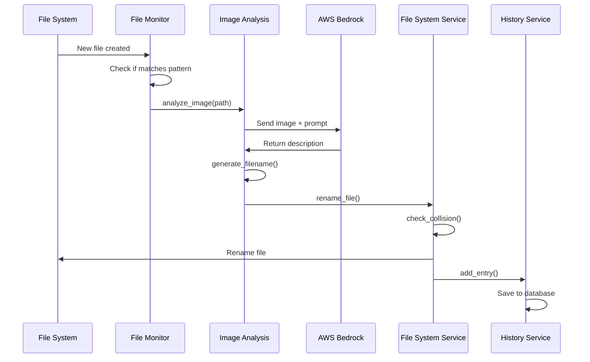
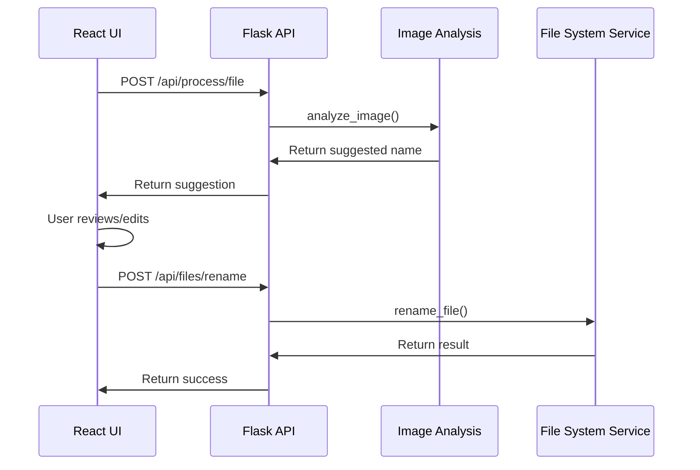

# Design Document

## Overview

Labelit is a cross-platform desktop application that automatically renames screenshot and image files using AWS Bedrock's multimodal AI capabilities. The system consists of a Python backend that handles file monitoring, AWS integration, and file operations, paired with a React frontend that provides user control and visualization.

The architecture follows a client-server pattern where the Python backend exposes a REST API consumed by the React frontend. The backend uses the watchdog library for file system monitoring, boto3 for AWS Bedrock integration, and SQLite for persistent storage of rename history and configuration.

## Architecture

### High-Level Architecture



### Component Layers

1. **Presentation Layer**: React-based web UI served via Flask
2. **API Layer**: Flask REST API endpoints for all operations
3. **Service Layer**: Business logic services (monitoring, analysis, file operations)
4. **Integration Layer**: AWS Bedrock client and file system operations
5. **Persistence Layer**: SQLite database for history and configuration

### Technology Stack

- **Backend**: Python 3.9+, Flask, boto3, watchdog, Pillow, cryptography
- **Frontend**: React 18, Axios, TailwindCSS
- **Database**: SQLite
- **AWS**: AWS Bedrock (Claude 3 Sonnet or similar multimodal model)
- **Deployment**: Standalone desktop application (packaged with PyInstaller)

## Components and Interfaces

### 1. File Monitor Service

**Responsibility**: Watch the monitored folder for new image files and trigger processing.

**Key Methods**:
- `start_monitoring(folder_path: str) -> None`: Begin watching the specified folder
- `stop_monitoring() -> None`: Stop the file watcher
- `get_screenshot_patterns() -> List[str]`: Return OS-specific screenshot patterns
- `is_screenshot(filename: str) -> bool`: Check if filename matches screenshot patterns

**Dependencies**: watchdog library, OS detection utilities

**Events Emitted**: `file_detected(file_path: str, file_type: str)`

### 2. Image Analysis Service

**Responsibility**: Send images to AWS Bedrock and generate filename suggestions.

**Key Methods**:
- `analyze_image(image_path: str) -> str`: Send image to Bedrock and get description
- `generate_filename(description: str, original_extension: str) -> str`: Create clean filename
- `sanitize_filename(text: str) -> str`: Apply clean filename format rules
- `get_fallback_filename(file_path: str) -> str`: Generate timestamp-based fallback

**Dependencies**: boto3, Pillow (for image preprocessing)

**Configuration**:
- AWS region
- Bedrock model ID (default: anthropic.claude-3-sonnet-20240229-v1:0)
- Max tokens for response
- Retry configuration (3 attempts, exponential backoff)

### 3. File System Service

**Responsibility**: Handle file operations including renaming and collision detection.

**Key Methods**:
- `rename_file(old_path: str, new_name: str) -> RenameResult`: Rename file with collision handling
- `check_collision(directory: str, filename: str) -> bool`: Check if filename exists
- `resolve_collision(directory: str, filename: str) -> str`: Generate unique filename with suffix
- `undo_rename(history_entry: HistoryEntry) -> bool`: Restore original filename
- `scan_folder(folder_path: str, patterns: List[str]) -> List[str]`: Find matching files

**Data Structures**:
```python
@dataclass
class RenameResult:
    success: bool
    old_path: str
    new_path: str
    error_message: Optional[str]
```

### 4. History Service

**Responsibility**: Persist and manage rename operation history.

**Key Methods**:
- `add_entry(entry: HistoryEntry) -> None`: Record a rename operation
- `get_history(limit: int = 1000) -> List[HistoryEntry]`: Retrieve history entries
- `undo_entry(entry_id: int) -> bool`: Mark entry as undone and trigger file restoration
- `prune_old_entries() -> None`: Keep only most recent 1000 entries

**Data Model**:
```python
@dataclass
class HistoryEntry:
    id: int
    timestamp: datetime
    original_path: str
    new_path: str
    original_filename: str
    new_filename: str
    undone: bool
```

**Database Schema**:
```sql
CREATE TABLE rename_history (
    id INTEGER PRIMARY KEY AUTOINCREMENT,
    timestamp TEXT NOT NULL,
    original_path TEXT NOT NULL,
    new_path TEXT NOT NULL,
    original_filename TEXT NOT NULL,
    new_filename TEXT NOT NULL,
    undone INTEGER DEFAULT 0
);
```

### 5. Configuration Service

**Responsibility**: Manage application configuration and AWS credentials.

**Key Methods**:
- `get_config() -> Config`: Load current configuration
- `update_config(config: Config) -> None`: Save configuration changes
- `set_aws_credentials(access_key: str, secret_key: str) -> None`: Store encrypted credentials
- `get_aws_credentials() -> Tuple[str, str]`: Retrieve decrypted credentials
- `validate_aws_credentials() -> bool`: Test credentials with Bedrock

**Data Model**:
```python
@dataclass
class Config:
    monitored_folder: Optional[str]
    auto_monitor_enabled: bool
    aws_region: str
    bedrock_model_id: str
```

**Database Schema**:
```sql
CREATE TABLE config (
    key TEXT PRIMARY KEY,
    value TEXT NOT NULL
);

CREATE TABLE credentials (
    service TEXT PRIMARY KEY,
    encrypted_data BLOB NOT NULL
);
```

**Security**: AWS credentials encrypted using Fernet (symmetric encryption) with a machine-specific key.

### 6. Flask REST API

**Endpoints**:

```
GET  /api/config
POST /api/config
POST /api/config/credentials
POST /api/config/validate-credentials

GET  /api/monitor/status
POST /api/monitor/start
POST /api/monitor/stop

POST /api/process/file
POST /api/process/batch
POST /api/process/cancel

GET  /api/files/pending
POST /api/files/rename
POST /api/files/scan

GET  /api/history
POST /api/history/undo

GET  /api/health
```

**Request/Response Examples**:

```json
// POST /api/process/file
{
  "file_path": "/path/to/screenshot.png"
}

// Response
{
  "success": true,
  "suggested_filename": "login-screen-with-username-field.png",
  "original_filename": "Screenshot 2024-12-05.png"
}
```

### 7. React Frontend

**Component Structure**:

```
App
├── Header
├── ConfigPanel
│   ├── FolderSelector
│   ├── MonitorToggle
│   └── CredentialsForm
├── FileList
│   ├── FileItem (repeated)
│   │   ├── Thumbnail
│   │   ├── FilenameDisplay
│   │   └── ActionButtons
│   └── BatchActions
├── HistoryPanel
│   └── HistoryItem (repeated)
└── StatusBar
```

**State Management**: React Context API for global state (config, monitoring status, file list)

**Key Features**:
- Real-time updates via polling (every 2 seconds when monitoring active)
- Thumbnail generation using HTML5 Canvas
- Drag-and-drop folder selection
- Inline filename editing with validation

## Data Models

### Core Domain Models

```python
from dataclasses import dataclass
from datetime import datetime
from typing import Optional, List
from enum import Enum

class ProcessingStatus(Enum):
    PENDING = "pending"
    PROCESSING = "processing"
    COMPLETE = "complete"
    ERROR = "error"

@dataclass
class ImageFile:
    path: str
    filename: str
    extension: str
    size_bytes: int
    created_at: datetime
    status: ProcessingStatus
    suggested_filename: Optional[str] = None
    error_message: Optional[str] = None
    thumbnail_data: Optional[bytes] = None

@dataclass
class RenameOperation:
    image_file: ImageFile
    new_filename: str
    timestamp: datetime
    
@dataclass
class BatchProcessingJob:
    id: str
    folder_path: str
    total_files: int
    processed_files: int
    status: ProcessingStatus
    started_at: datetime
    completed_at: Optional[datetime] = None
    errors: List[str] = None
```

## Data Flow

### Automatic File Detection Flow



### Manual Rename Flow



